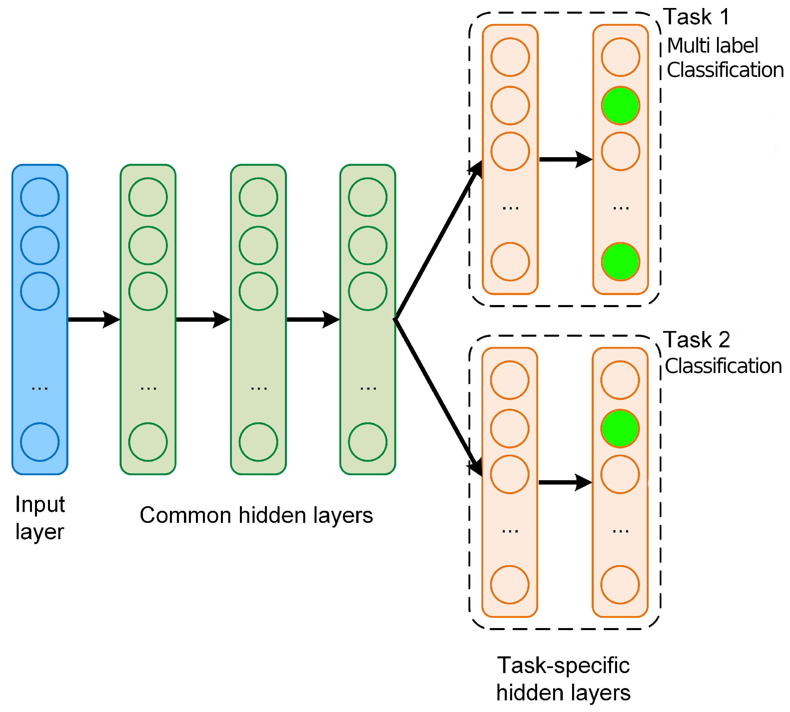

# Strain Integration 

This document serves as a guide and journal towards the integration of strain metrics into Deep Docking. 

## Strain Metrics (and other potential metrics)

Currently, I am using the strain metric published by [Gu et al (Irwin & Shoichet Group)](https://pubs.acs.org/doi/10.1021/acs.jcim.1c00368). 

At a high-level, this is a "torsion strain" metric that measures the energetic cost (in A.U. called "torsional energy units") of given 3D conformer by summing the individual torsion energies (A. U.) of each each valid torsional bond, comprised of 4 atoms (e.g. continously connected atoms). The basic principle is to assign energy values to SMARTs patterns within the molecule that are capable of having torsion strain by comparing their dihedral angles to what is present in an XML database. The XML database itself is based on the observed dihedral angles of various SMARTs pattern found in crystallographic repositores: the CSD and PDB.

This XML database is adapted from the work of the [Rarey group](https://www.zbh.uni-hamburg.de/en/forschung/amd/datasets/torsion-library.html). One of their newest publications, titled [The Torsion Library: Semiautomated Improvement of Torsion Rules with SMARTScompare](https://pubs.acs.org/doi/full/10.1021/acs.jcim.2c00043) is not currently listed on their website but is available at the prior link.

Overall, the logic of the XML library as implemented by Gu et al is to associate well represented torsion angles with a low energy value, and poorly represented torsion angles with a high energy value. 

I have extensively analyzed the Gu et al method as well as modified the code to allow for some features relevant to Deep Docking, or even general use. The modifications are as follows:

* Integration of a native SDF mol supplier function to avoid the need to convert mol2 file formats. 

* The ability to specify output files for the resulting CSV of strain energies

* The ability to run the script from an arbitrary user directory (essenitally importing the XML library from a user specified location). Notably, this allows for relatively simple parallel processing of the strain calculation using tools like GNU Parallel. 

This updated code is stored on a private repository of mine, but will be moved into a public facing repository in the near future. 

Additionally during my analysis of the code, I noticed some odd behavior wherein non-identical torsion patterns are considered identical and thus removed. I believe this either an erroneous design decision, or an unintentional bug. 

The method was then benchmarked against two publically available SBVS datasets: the [GPCR-bench](https://pubs.acs.org/doi/full/10.1021/acs.jcim.5b00660) and [LIT-PCBA](https://pubs.acs.org/doi/10.1021/acs.jcim.0c00155) datasets. A full write up of the benchmarking data will be available in the future. However, initial appraisal revealed the potential improvement in various enrichment metrics commonly used in SBVS (e.g. EF1%, EF5%, ROC-AUC, LogAUC) when using a strain filter to exclude compounds with strains above a certain threshold (tenatively, somewhere between 5.5 and 7.0 Torsional Energy Units). 

Our labs are also assessing the potential of other strain methodologies (e.g. [Freeform](https://docs.eyesopen.com/applications/szybki/theory/freeform_theory.html) from OpenEye) that could be used in conjunction or orthogonally with the Gu et al method. This effort is being primarily led by Prof. Francesco Gentile and Stasa Skorupan. 

While out of the scope of this document at the present moment, it is worthwhile to note that additional metrics for improved SBVS performance are being explored, such as hydrogen bonding environments. This effort is being led by Prof. Francesco Gentile and Jean-Paul Kazzi. 

It is my hope that the work outlined in this document will be a useful contribution to the ongoing efforts of our labs to improve the performance of DD & SBVS. 

## Integration into Deep Docking

Currently, the integration of strain metrics into Deep Docking is being written as classification task, based on our benchmarking data. Deep Docking natively runs as a classification model for docking scores, so much of the same logic can be repurposed. Crucially, however, we will need to modify the model to function in a "multi-task" fashion, where the model is trained to predict both docking scores and strain energies. An example of such a model architecture is sourced from this [StackExchange post](https://ai.stackexchange.com/questions/34785/what-is-the-difference-between-multi-label-and-multi-task-classification):

In the architecture above, the model is sharing representation layers from the input data, but then splits into two separate output layers for the two tasks. This could be advantageous for several reasons but I need to discuss this with Francesco. It is also possible, of course, to simply have two separate models, one for docking scores and one for strain energies. This can be an easier approach as their loss functions are indepndent of one another. 

### Strain Energy label extraction 

It will be necessary to extract the strain energy labels from the Gu et al code, preferably in analogous way to Deep Docking. 

Docking scores are extracted in `phase_4`, via `extract_labels.py`. The output is a txt file like `validation_labels.txt` with the following format. 

r_i_docking_score,ZINC_ID  
-10.5406,PV-006284534362_Isomer2

Initial demo script of that functionality available in `extract_strain_labels.py`. Needs some additional tweaks to be fully functional. 

Worthwhile to think of how exactly strain csv files will be saved in the context of Deep Docking. To maintain consistency, it would probably be best to save to a `strain` directory within an `iteration_` directory, just like `docked` is. 

Additionally, I believe Francesco's code can use the sdfgz files directly. I wonder if the `refactor_Torsion_Strain.py` and `refactor_TL_Functions.py` can be modified to have an sdfgz mol supplier? That would save the need to convert out of the sdfgz format. 

Additionally, at least in my benchmarking work, I noticed it was possible to have multiple conformers per molecule (sometimes). I dealt with this using the `$SCHRODINGER/utilities/glide_sort` utility (which also allowed for decompression), but I think it would be better to explicitly force Glide to only record the best scoring conformer. I think this is possible with the inp file, I should check with Schrodinger. 