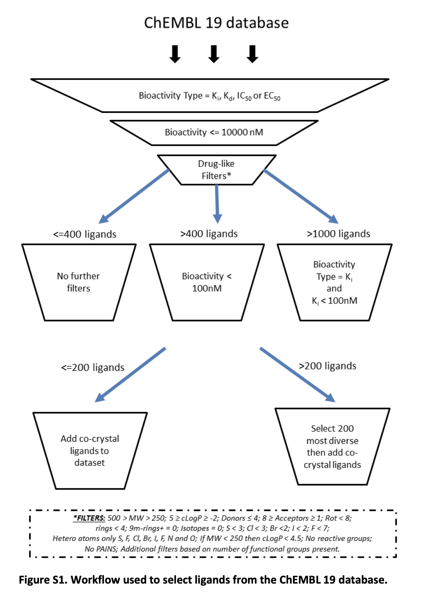

# Chembl Ligand Search Notes

## Brief Overview of ChEMBL

From their own recent paper: [The ChEMBL Database in 2023: a drug discovery platform spanning multiple bioactivity data types and time periods](https://academic.oup.com/nar/article/52/D1/D1180/7337608)

Where is this data coming from?

> The core content of the ChEMBL database is published bioactivity data, from a set of seven Medicinal Chemistry journals: Journal of Medicinal Chemistry, Bioorganic & Medicinal Chemistry Letters, European Journal of Medicinal Chemistry, Bioorganic & Medicinal Chemistry, Journal of Natural Products, ACS Medicinal Chemistry Letters and MedChemComm. For every paper in these journals all bioactivity measurements are regularly extracted and curated. However, the data in ChEMBL comes from ∼230 different journals spanning a broad variety of different biomedical disciplines. Journals other than the core set have less consistent coverage as data was extracted only if they were deemed interesting as part of a specific project or collaboration. Table 1 shows the 20 top journals in terms of the numbers of extracted documents, illustrating the variety of biomedical disciplines and communities covered by the data in ChEMBL, ranging from, e.g. medicinal chemistry and drug discovery to food chemistry, crop science, environmental science, and biotechnology.

Some things I think are relevant but not critical, inexhaustive: 

> Chemical probes flag
>
>Chemical probes are highly selective modulators of drug discovery relevant targets, which can serve as valuable tools to help decipher target biology (38). To allow easier tracking of a probe's publication history, we flag chemical probes within a new field in the MOLECULE_DICTIONARY named CHEMICAL_PROBE. This indicates whether the compound is a chemical probe as defined by chemicalprobes.org (1 = yes, 0 = default value). The dataset of chemical probes was retrieved from the chemicalprobes.org website and filtered for probes that were assigned an In Vivo Rating or In Cell Rating of 3 stars or more. The annotations will be updated with every new ChEMBL release and other sources of information for defining a chemical probe may be added in the future. ChEMBL release 33 currently includes 388 molecules flagged as chemical probes.

Typically speaking, chemical probes are a "step above" a known active compound from a reputable source, but a step below a drug (for a variety of reasons - often related to the inability to develop the probe further). The criteria for something being a 'probe' are rarely exact. 

>4 stars = Recommended as a probe for this target  
>3 stars = Best available probe for this target, or a high-quality probe that is a useful orthogonal tool  
>2 stars = Insufficient validation data to recommend  
>1 star = Not recommended as a probe for this target  
>The Chemical Probes Portal only endorses compounds as chemical probes for use as specific and selective modulators of the proposed target if they receive three or more (3-4) stars.  

To me, a probe is a ligand with known target engagement and known activity (we know it interacts with the target, we know it has an *in vitro*/*in vivo* effect that is *driven* by interaction). Associating target engagement with functional response is decidedly harder than how it may seem. I generally agree with what's written here. [Chemical Probes (Classical Modulators) Criteria
](https://www.chemicalprobes.org/info/classical-modulators). 

I go through this all to say: retaining high quality probes via docking can be considered is a great sign for screening related outcomes. 

Finally, ChEMBL has some tutorials - I haven't used them yet. 

https://www.ebi.ac.uk/training/events/guide-explore-drug-compounds-and-their-biological-targets-using-chembl/

## Thoughts on ligand criteria for our use case 

We want to get a set of active and inactive ligands that match some quality criteria. We have seen the lit-pcba approach that used PubChem, that included for the actives/inactives, (essentially): 

### LIT PCBA Ligand Selection (PubChem)

1. **Organic Compound Selection:**
   - Exclude molecules with atoms outside the typical organic range: H, C, N, O, P, S, F, Cl, Br, I.

2. **False Positives Reduction (For Actives Only):**
   - **Hill Slope Criteria:** Keep compounds with 0.5 < Hill slope < 2.0, at a high level this means how biologically reasonable the curve is.
   - **Frequency of Hitting (FoH) Threshold:** Exclude compounds with FoH > 0.26.
   - **Specific Assay Filters:** Eliminate compounds flagged for aggregation, autofluorescence, or luciferase inhibition.

3. **Molecular Property Constraints:**
   - Molecular weight: 150 Da < MW < 800 Da
   - Lipophilicity: -3.0 < AlogP < 5.0
   - Rotatable bonds: Number < 15
   - H-bond acceptor and donor counts: Count < 10
   - Total formal charge: -2.0 < Charge < +2.0

   
I like this approach overall as it does make the screens very difficult (I like the Hill Slope metric a lot). Thomas' thinks it may have been too restrictive. The other issue is that it doesn't really do anything about picking PDB templates with any real specifics beyond that they literally exist. For instance, the Beta2 set includes covalent agonist bound structures, which may not perform well. It included structures with multiple cocrystallized ligands ("allosteric modulators") but did not try to separate the ligands to a particular binding site (this is more or less impossible to do without essentially having probe like quality). I'm not sure what they should have done, but the combination of being strict with your actives and the fact the actives may not even be suited to the protein binding site examined may present an overly pessimistic view. 

There are some papers in the GPCR field that might be useful for us, this one uses ChEMBL and provides some nice commentary and analysis: 

[GPCR-Bench: A Benchmarking Set and Practitioners’ Guide for G Protein-Coupled Receptor Docking](https://pubs.acs.org/doi/full/10.1021/acs.jcim.5b00660)

I think the paper is a good read. I'm going to leave some quotes that I think are relevant. (@Stasa: I'd recommend reading this paper).

Here is a summary of their selection process (note, they actually have a different process for a cool little case study they do. It's not critical for us choosing ligands, but it is a nice story they tell about some docking related stuff - I would save it for later if you have too much work as is): 

### GPCR-Bench: Ligand Retrieval Workflow from ChEMBL19 Database

1. **Initial Extraction:**
   - **Automated Script:** Use an automated script based on the ChEMBL Web Service API to extract ligands for each target from the ChEMBL19 database.
   - **Automation Goal:** The process is designed to be as automated as possible, allowing for periodic updates with new ChEMBL releases.

2. **Initial Filtering Criteria:**
   - **Bioactivity Types:** Only consider compounds with bioactivity_type of Ki, Kd, IC50, or EC50.
   - **Value Threshold:** Compounds must have a value less than or equal to 10,000 to be stored. (Note! This is equivalent to 10 uM)

3. **Refined Filtering Criteria (Due to Potential False Positives):**
   - **Avoid High Concentrations:** Exclude compounds that may introduce false positives through nonspecific mechanisms, such as compound aggregation. (Note! The 10 uM limit can be considered to forgiving and at increased risk for false positives, think aggregation or solubility.)
   - **Assay Description:** Exclude compounds with assay_description of PUBCHEM_BIOASSAY or DRUGMATRIX. (Note! They claim "these data sources led to many false positives in the set", but I am not exactly sure how they are defining this. I believe LIT PCBA did use this data, so I am curious.)

4. **Drug-likeness Filters:**
   - Apply filters for "drug-likeness," including sulfur count, chlorine count, molecular weight, hydrogen donors and acceptors, rotatable bonds, number of rings, and atom count.

5. **Further Target-specific Filtering:**
   - **For Targets with >1000 Ligands:** Only include ligands with Ki values ≤ 100 nM.
   - **For Targets with >400 Ligands:** Include ligands with Ki, Kd, IC50, or EC50 values ≤ 100 nM.
   - **For Targets with <400 Ligands:** Include ligands with Ki, Kd, IC50, or EC50 values ≤ 10,000 nM.

6. **Diversity Selection:**
   - For targets with more than 200 ligands, select 200 maximally diverse ligands based on ECFP4 fingerprints using the “Diverse Molecules” component in Pipeline Pilot. (Note! While I would agree with this - it is another step to making the active detection harder, maybe Thomas would not agree)

7. **Inclusion of Cocrystallized Ligands:**
   - Add all cocrystallized ligands available in the PDB to each set, regardless of whether they meet the 10 μM threshold, for cross-docking experiments.

## (Skip this for now, move to decoys) Additional Active A2AR Ligand Set Selection for their case study: 

> We retrieve a set of 227 highly diverse molecules from a previous virtual screen of an A2AR homology model based on the beta-1 adrenergic receptor

- **Screening Results:**
  - **Top Performers:** Among these, 8 molecules were found to have very high inhibition capabilities, with biochemically confirmed activity.
  - **Strong Candidates:** An additional 12 compounds demonstrated medium to high inhibition, marking them as significant findings (these 20 compounds are the original hits, all with IC50 values below 100 μM).
  - **Consistent Activity:** 33 molecules showed consistent activity across two data points, though they either did not undergo dose-response testing or had IC50 values greater than 100 μM upon further analysis.
  - **Potential Interest:** A further 100 compounds exhibited some level of activity but were characterized by low or variable inhibition levels.

## Decoys 

They used a common DUD-E approach: 

>DUD-E style decoys were automatically generated using the DUD-E online generation tool. DUD-E generates matched decoy sets with similar physicochemical properties to the true ligand but dissimilar 2D topology. This ensures that the docking adds value beyond selecting true positives by their physical properties but also minimizes the likelihood that the decoys would in fact actually bind. It is important to stress that such a decoy set by design challenges structure-based methods (docking), but will always perform well in a ligand-based method and should never be used to test these.

## Protein Structure Selection 

> A single X-ray structure was chosen for each target in the docking studies, with preference given to the highest resolution structure available.

This is more sophisticated than LIT PCBA, but simply picking highest resolution is not always ideal. They are experts (this is Heptares, a very famous and successful drug discovery company focused on virtual screening of GPCRs - Michael from my group worked there) and I am sure they are aware. 

## Ligand Preparation for Docking 

I won't quote it all here, but it is a more or less "normal" ligand preparation workflow. A key difference for us is that we typically only consider the most probable 3D structure for a given input. They allow for more than one 3D structure. They also say they make low energy conformers, but this part is confusing to me because they use *Glide* as their docking engine. Glide does a 'ConfGen' during it's docking (this makes low energy conformers that are attempted to be docked to the protein via the grid). However, it's not worth stressing over. We do a very similar approach. They just seem to be sampling more conformers than default. 

## Docking 

Not much to really say because I doubt we would copy this exactly, they use Glide and other stuff post processing tools we either aren't using or don't have (not having WaterMap is a shame). Some nice commentary later on the choice of PDB (!) in terms of docking outcomes. 

> We chose 200 maximally diverse ligands based on ECFP4 fingerprints (or included all where <200 annotated ligands). For each ligand, an average of 60 computational decoys was generated using the online DUD-E tool (http://dude.docking.org/generate). The entire set is available for download at http://dude.docking.org/heptares.

## Conclusion 

I figure this might be a good intro into how and why you make datasets in a certain way, I am now going to play around in ChEMBL and see what's possible. 

We should also discuss choosing protein structures and docking itself later. 